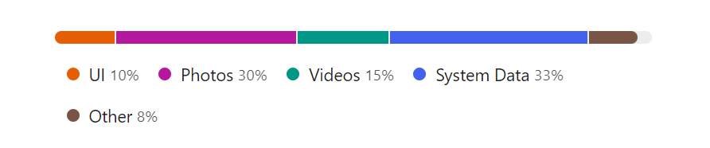

# React Usage Bar Graphic Component




[](https://github.com/semantic-release/semantic-release)


[](https://opensource.org/licenses/MIT)

## 🔌 Installation

Install via npm

```sh
npm install react-usage-bar --save
```

or yarn

```sh
yarn add react-usage-bar
```

<br>

## 🔧 Usage

Live **demo** at: [https://chrisuser.github.io/react-usage-bar/docs/](https://chrisuser.github.io/react-usage-bar/docs/)

The usage bar needs to receive an array of items. In order to display all the values correctly every item should follow this interface:

### Item type

| Attribute | Type   | Required |
| --------- | ------ | -------- |
| value     | number | Yes      |
| name      | string | Yes      |
| color     | string | No       |

The `value` represents the quantity of space occupied by the sector with a certain `name`. The `color` property could be used to specify the background color of that portion in the bar.

The `total` value is also required.

### Example

```javascript
import * from 'react'
import UsageBar from 'react-usage-bar'
import "react-usage-bar/build/index.css"

const App = () => {

  const itemsToDisplay = [
  {
    name: "UI",
    value: 10,
    color: "#000000",
  },
  {
    name: "Photos",
    value: 30,
  },
  {
    name: "Videos",
    value: 15,
  },
  {
    name: "System Data",
    value: 33,
  },
  {
    name: "Other",
    value: 8,
  }]

  return <UsageBar items={itemsToDisplay} total={100} />
})

export default App
```

<br>

## Props (Options)

### **showPercentage** | _boolean_ | default: `false`

When true shows the percentage value of all the elements.

### **removeLabels** | _boolean_ | default: `false`

When true hides all the tooltips or lables of the items.

### **darkMode** | _boolean_ | default: `false`

Enables the component to work in dark-mode.

### **compactLayout** | _boolean_ | default: `false`

The new compact design. _**Try it**_.

<br>

## CSS Styles

You must import the style directly from the package directory, like this:

```javascript
import "react-usage-bar/build/index.css"
```

The main css classes are the following (**Spoiler**: There are more of them):

### `.UsageBar`

The main div of the component.

### `.UsageBar__error`

The error message.

### `.UsageBar__bar`

The actual bar of the component.

### `.UsageBar__bar__element`

The single item represented in the bar.

### `.UsageBar__bar__element--tooltip`

The tooltip of the item in which are written all the textual info.

- `.UsageBar__bar__element--tooltip--element__percentage` - Used to control the style of the percentage lables.

- `::after` - Is used to make the triangular shape on the bottom (or top) of the tooltips.

<br>

## 📖 Docs

You can run the project in a local enviroment using [Storybook](https://storybook.js.org/):

```
$ yarn storybook
```

<br>

## Contribution

If you have a suggestion that would make this component better feel free to open a pull request or create an issue for any bug you find.

## Licence

React Usage Bar is [MIT licensed](https://github.com/ChrisUser/react-usage-bar/blob/master/LICENSE).
