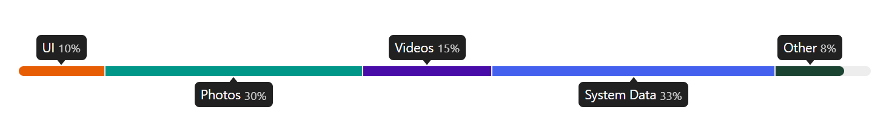

# React Usage Bar Graphic Component




[](https://opensource.org/licenses/MIT)

Display disc sectors, stats and more with this lightweight user-friendly React component.\
Now compatible with [Tailwind](https://tailwindcss.com/).

## 🔌 Installation

Install via npm

```sh
npm install react-usage-bar --save
```

or yarn

```sh
yarn add react-usage-bar
```

<br>

## Compatibility table

| Package v | Node       |
| --------- | ---------- |
| <= 1.1.18 | <= 16.14.x |
| > 1.1.19  | 18.x.x     |

<br>

## 🔧 Usage

Live **demo** at: [https://chrisuser.github.io/react-usage-bar/](https://chrisuser.github.io/react-usage-bar/)

The usage bar needs to receive an array of items. In order to display all the values correctly every item should follow this interface:

### Item type

| Attribute    | Type   | Required |                                                                                        |
| ------------ | ------ | -------- | -------------------------------------------------------------------------------------- |
| value        | number | Yes      |                                                                                        |
| name         | string | Yes      |                                                                                        |
| color        | string | No       |                                                                                        |
| className    | string | No       |  |
| dotClassName | string | No       |  |

The `value` attribute indicates the amount of space taken up by the sector with a specific `name`. The `color` property can be utilized to define the background color of that particular portion in the bar.

To further customize the sector element, you can apply your own CSS classes or Tailwind classes using the `className` attribute.

In case you are using the **compact layout** and have not specified a `color` value, you can customize the `dotClassName` similarly to the `className` attribute.

> The defined `color` property value will have a **priority on the background color** defined in the `className` and/or `dotClassName` ones.\
> <br />
> It is recommended to use **exclusively** `color` or one of the two other properties per item.

### Example

```javascript
import * from 'react'
import UsageBar from 'react-usage-bar'
import "react-usage-bar/dist/index.css"

const App = () => {

  const itemsToDisplay = [
  {
    name: "UI",
    value: 10,
    color: "#000000",
  },
  {
    name: "Photos",
    value: 30,
  },
  {
    name: "Videos",
    value: 15,
  },
  {
    name: "System Data",
    value: 33,
  },
  {
    name: "Other",
    value: 8,
  }]

  return <UsageBar items={itemsToDisplay} total={100} />
})

export default App
```

The `total` prop is also required.

<br>

## Props (Options)

### **showPercentage** | _boolean_ | default: `false`

When true, shows the percentage value of all the elements.

### **showLabels** | _boolean_ | default: `true`

When false, hides all the tooltips or lables of the items.

### **darkMode** | _boolean_ | default: `false`

When true, enables the component to work in dark-mode.

### **compactLayout** | _boolean_ | default: `false`

When true, enables the new compact design. _**Try it**_. 😎

### **showFallbackColors** | _boolean_ | default: `false`

When true, this feature dynamically assigns a random color to the background of any items where a value has not been specified

### **errorMessage** | _string_ | default: `Error: Total elements values exceed 100%.`

Customize the error string that appears when the total values of the provided items exceeds 100%.

---

<br>

**Custom classes props:** add custom or Tailwind classes to elements of the component.

### **usageBarContainerClassName** | _string_

Can customize the main div of the component.

### **usageBarClassName** | _string_

Can customize the actual bar element of the component.

### **tooltipClassName** | _string_

Can customize the tooltip div of the item in which are written all the textual info.

### **errorMessageClassName** | _string_

Can customize the style of the error message.

<br>

## CSS Styles

You must import the style directly from the package directory, like this:

```javascript
import "react-usage-bar/build/index.css"
```

The project variables are:

- `--text-color`
- `--background-tooltip-color`
- `--background-bar-color`

The main css classes are the following:

### `.u-UsageBar__error`

The error message.

### `.u-UsageBar-light`

The class that contains all the colors for the light mode.

### `.u-UsageBar-dark`

The class that contains all the colors for the dark mode.

### `.c-UsageBar`

The main div of the component.

### `.o-UsageBar__bar`

The actual bar of the component.

### `.o-UsageBar__bar__element`

The single item represented in the bar. This class is vastly used.

### `.o-UsageBar__bar__tooltip`

The tooltip of the item in which are written all the textual info.

- `.o-UsageBar__bar__tooltip__percentage` - Used to control the style of the percentage lables.
- `::after` - Is used to make the triangular shape on the bottom (or top) of the tooltips.

### `.o-UsageBar__bar__elements__labels__container`

Used in the compact layout to list all the labels for the elements.

### `.o-UsageBar__bar__elements__label`

The labels for the elements of the bar.

### `.o-UsageBar__bar__elements__label--dot`

The colored dot before the label of the elements.

<br>

## 📖 Docs

You can run the project in a local enviroment using [Storybook](https://storybook.js.org/):

```
$ yarn storybook
```

<br>

## Contribution

If you have a suggestion that would make this component better feel free to fork the project and open a pull request or create an issue for any idea or bug you find.\
Remeber to follow the [Contributing Guidelines](https://github.com/ChrisUser/.github/blob/main/CONTRIBUTING.md).

<br>

## Licence

React Usage Bar is [MIT licensed](https://github.com/ChrisUser/react-usage-bar/blob/master/LICENSE).
